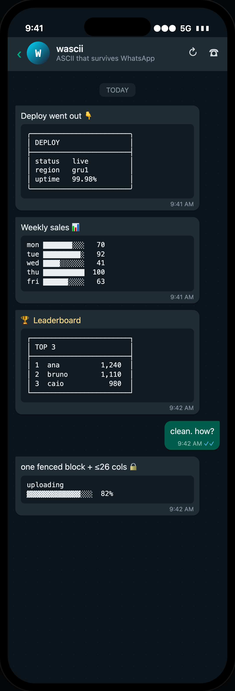
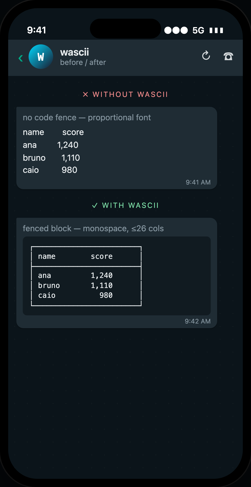

<!-- readme-padrao:header -->
<!-- Banner -->
<div align="center">
  
</div>

<!-- Typing -->
<div align="center">
  
</div>

<div align="center">

  <br>
  
  <br><br>

  <p><strong>Monospace boxes, bars, charts and leaderboards that <strong>actually line up</strong> on a phone, not just in your editor.</strong></p>

  <p>
    <a href="LICENSE"></a>
    
    
    <a href="https://github.com/leonardocandiani/wascii/pulls"></a>
  </p>

  <p>
    <a href="#why-this-exists">Why this exists</a> •
    <a href="#the-seven-rules">The seven rules</a> •
    <a href="#quick-start">Quick start</a> •
    <a href="#the-safe-palette-the-short-version">The safe palette (the short version)</a> •
    <a href="#examples-gallery">Examples gallery</a> •
    <a href="#contributing">Contributing</a> •
    <a href="#license">License</a>
  </p>
</div>

<br>

> **wascii** encodes the handful of rules that separate an aligned box from a proportional-font mess on WhatsApp: fence it, keep it under 26 columns, use only single-cell glyphs, pad every line, commit to one border family.

> Not affiliated with or endorsed by Anthropic. "Claude" and "Claude Code" are Anthropic trademarks.

## What it is

```yaml
product: agent skill and reference for ASCII visuals that survive WhatsApp on a phone
rules:   R0 fence · R1 26 columns · R2 one glyph one cell · R3 pad · R4 one border family · R5 · R6
covers:  boxes, progress bars, bar charts, tables, leaderboards, dividers
palette: the safe glyph set that renders one cell wide on iOS and Android
use:     drop SKILL.md into ~/.claude/skills/wascii, or read the rules as a human
gallery: ready-to-paste examples in the README and templates/
license: MIT
```

<!-- /readme-padrao:header -->

## Why this exists

WhatsApp will render a perfectly aligned box on your laptop and **shatter it on a phone**. Send the same drawing without a code fence and it collapses into a proportional-font mess. The difference between art and garbage is a handful of rules about width, fences, and which glyphs are exactly one cell wide.

`wascii` is a [Claude](https://claude.com) **agent skill** (and a plain-English reference) that encodes those rules so structured chat visuals line up the first time, every time.

<div align="center">

</div>

Left bubble: no fence, proportional font, columns drift. Right bubble: one fenced block, ≤ 26 columns, perfectly square. Same data, one rule set apart.

---

## The seven rules

| # | Rule | Why |
|---|------|-----|
| **R0** | Always wrap it in a **fenced code block** (triple backticks) | WhatsApp only monospaces fenced text. No fence → no alignment. |
| **R1** | Never exceed **26 characters** per line | The narrowest iPhone wraps past ~26 cells, and a wrap detonates the drawing. |
| **R2** | **One glyph, one cell**, or don't use it | Emoji and CJK are double-width and shove every column out of line. |
| **R3** | **Pad** every inner line to the same width | The right border only lands true if every row is padded to one inner width. |
| **R4** | Pick **one border family** and commit | Light, heavy and double corners don't join. Rounded (`╭─╮`) is the house style. |
| **R5** | **Spaces only.** No tabs | Tabs expand to different stops on every client. |
| **R6** | **Emoji live outside** the frame | An emoji inside a box is the #1 way ASCII breaks on WhatsApp. |

> Full rationale with worked before/after examples in [`reference/rules.md`](reference/rules.md).

---

## Quick start

### As a Claude Code / agent skill

Drop the folder into your skills directory:

```bash
git clone https://github.com/leonardocandiani/wascii.git ~/.claude/skills/wascii
```

Now whenever your agent is about to send a box, table, bar or ranking to WhatsApp, it follows [`SKILL.md`](SKILL.md): fence it, keep it ≤ 26 columns, single-cell glyphs only, emoji outside.

### As a human

Skim [`reference/characters.md`](reference/characters.md) for the safe glyph palette, grab a template from [`examples/`](examples), and paste it into a WhatsApp message **inside triple backticks**.

---

## The safe palette (the short version)

```
╭ ╮ ╰ ╯ ─ │
┌ ┐ └ ┘ ├ ┤ ┬ ┴ ┼
█ ▓ ▒ ░  ▁▂▃▄▅▆▇█
→ ● ○ ✓ ✗ ★ ·
```

Everything above is **one cell wide**. The trap: `✓` (U+2713) is one cell, but `✔️` (U+2714 + emoji selector) is two. Inside a frame, always reach for the plain text glyph. Full table (including the `✓` vs `✔️` gotcha) in [`reference/characters.md`](reference/characters.md).

---

## Examples gallery

Copy-paste, all ≤ 26 columns, all phone-tested:

| File | What's inside |
|------|---------------|
| [`examples/boxes.md`](examples/boxes.md) | Frames, titled boxes, stat cards, callouts |
| [`examples/tables.md`](examples/tables.md) | Key/value and multi-column tables |
| [`examples/bars-and-charts.md`](examples/bars-and-charts.md) | Progress bars, bar charts, sparklines, gauges |
| [`examples/leaderboards.md`](examples/leaderboards.md) | Rankings, podiums, movement arrows |
| [`examples/titles-and-banners.md`](examples/titles-and-banners.md) | Section headers, wordmarks, dividers, pills |

A taste:

```
╭────────────────────────╮
│ DEPLOY                 │
├────────────────────────┤
│ status   live          │
│ region   gru1          │
│ uptime   99.98%        │
╰────────────────────────╯
```

```
mon ███████░░░   70
tue █████████░   92
wed ████░░░░░░   41
thu ██████████  100
```

---

## Contributing

New templates are welcome. The one hard rule: **every drawing must obey its own rules** (≤ 26 columns, one border family, zero emoji inside a frame). See [`CONTRIBUTING.md`](CONTRIBUTING.md). There's a width-check script in CI that rejects any block over 26 cells.

---

## License

MIT © [Leonardo Candiani](https://leonardocandiani.com.br), see [`LICENSE`](LICENSE).

<div align="center">
<br>
<sub>Built for agents that talk to humans on WhatsApp.</sub>
</div>

<!-- readme-padrao:footer -->
<br>

---

<div align="center">
  <p><strong>Built by <a href="https://github.com/leonardocandiani">Leonardo Candiani</a></strong> · More projects at <a href="https://github.com/leonardocandiani?tab=repositories">github.com/leonardocandiani</a></p>
  <p>Leonardo Candiani builds AI agents that talk, decide and close deals. Cofounder of SixQuasar, operating Proteauto, SegSmart and IACall end to end.</p>
  <a href="https://leonardocandiani.com.br">
    
  </a>
  <a href="https://github.com/leonardocandiani">
    
  </a>
  <a href="https://instagram.com/leonardocandiani">
    
  </a>
  <a href="https://youtube.com/@oleonardocandiani">
    
  </a>
</div>

<br>

<div align="center">
  
</div>
<!-- /readme-padrao:footer -->
